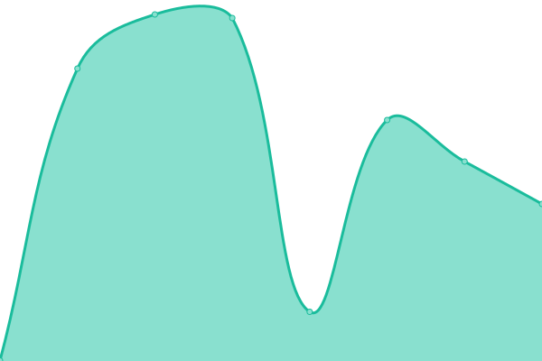
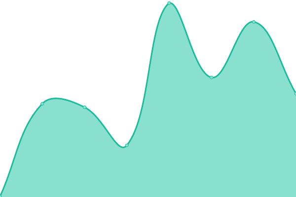
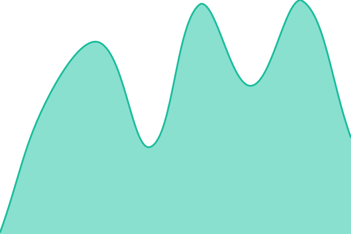
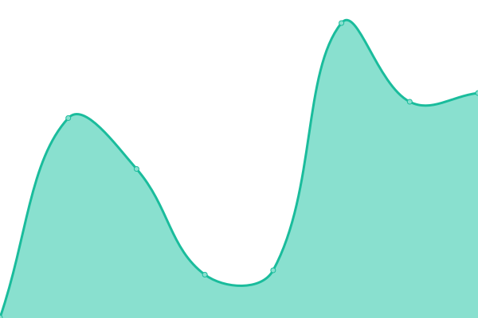

# [📈 Live Status](https://status.tyis.co.jp): <!--live status--> **🟧 Partial outage**

This repository contains the open-source uptime monitor and status page for [TOYO Internet Service Co., Ltd.](https://www.tyis.co.jp), powered by [Upptime](https://github.com/upptime/upptime).

With [Upptime](https://upptime.js.org), you can get your own unlimited and free uptime monitor and status page, powered entirely by a GitHub repository. We use [Issues](https://github.com/tyis/status-tyis-co-jp/issues) as incident reports, [Actions](https://github.com/tyis/status-tyis-co-jp/actions) as uptime monitors, and [Pages](https://status.tyis.co.jp) for the status page.

<!--start: status pages-->
<!-- This summary is generated by Upptime (https://github.com/upptime/upptime) -->
<!-- Do not edit this manually, your changes will be overwritten -->
<!-- prettier-ignore -->
| URL | Status | History | Response Time | Uptime |
| --- | ------ | ------- | ------------- | ------ |
|  [TOYO Internet Service](https://www.tyis.co.jp) | 🟩 Up | [toyo-internet-service.yml](https://github.com/tyis/status-tyis-co-jp/commits/HEAD/history/toyo-internet-service.yml) | 

 359ms
     
 | 

<a href="https://status.tyis.co.jp/history/toyo-internet-service">100.00%</a>
    

|  [TOYO Consultancy Services Korea](https://www.toyocs.net) | 🟥 Down | [toyo-consultancy-services-korea.yml](https://github.com/tyis/status-tyis-co-jp/commits/HEAD/history/toyo-consultancy-services-korea.yml) | 

 309ms
     
 | 

<a href="https://status.tyis.co.jp/history/toyo-consultancy-services-korea">99.95%</a>
    

|  [TOYO Cloud](https://cloud.tyis.co.jp) | 🟩 Up | [toyo-cloud.yml](https://github.com/tyis/status-tyis-co-jp/commits/HEAD/history/toyo-cloud.yml) | 

 729ms
     
 | 

<a href="https://status.tyis.co.jp/history/toyo-cloud">100.00%</a>
    

|  [TOYO Hosting](https://hosting.tyis.co.jp) | 🟩 Up | [toyo-hosting.yml](https://github.com/tyis/status-tyis-co-jp/commits/HEAD/history/toyo-hosting.yml) | 

 218ms
     
 | 

<a href="https://status.tyis.co.jp/history/toyo-hosting">100.00%</a>
    

|  [データ消去の窓口](https://erasure.tyis.co.jp) | 🟩 Up | [データ消去の窓口.yml](https://github.com/tyis/status-tyis-co-jp/commits/HEAD/history/データ消去の窓口.yml) | 

 179ms
     
 | 

<a href="https://status.tyis.co.jp/history/データ消去の窓口">100.00%</a>
    

|  [東洋電子商会](https://shop.tyis.co.jp) | 🟩 Up | [東洋電子商会.yml](https://github.com/tyis/status-tyis-co-jp/commits/HEAD/history/東洋電子商会.yml) | 

 200ms
     
 | 

<a href="https://status.tyis.co.jp/history/東洋電子商会">100.00%</a>
    

|  [Recycle Pocket](https://www.recyclepocket.com) | 🟥 Down | [recycle-pocket.yml](https://github.com/tyis/status-tyis-co-jp/commits/HEAD/history/recycle-pocket.yml) | 

 433ms
     
 | 

<a href="https://status.tyis.co.jp/history/recycle-pocket">100.00%</a>
    

|  [産廃見積.com](https://産廃見積.com) | 🟩 Up | [com.yml](https://github.com/tyis/status-tyis-co-jp/commits/HEAD/history/com.yml) | 

 561ms
     
 | 

<a href="https://status.tyis.co.jp/history/com">100.00%</a>
    

<!--end: status pages-->

[**Visit our status website →**](https://status.tyis.co.jp)

## 📄 License

- Powered by: [Upptime](https://github.com/upptime/upptime)
- Code: [MIT](./LICENSE) © [Anand Chowdhary](https://anandchowdhary.com), supported by [Pabio](https://pabio.com)
- Data in the `./history` directory: [Open Database License](https://opendatacommons.org/licenses/odbl/1-0/)
